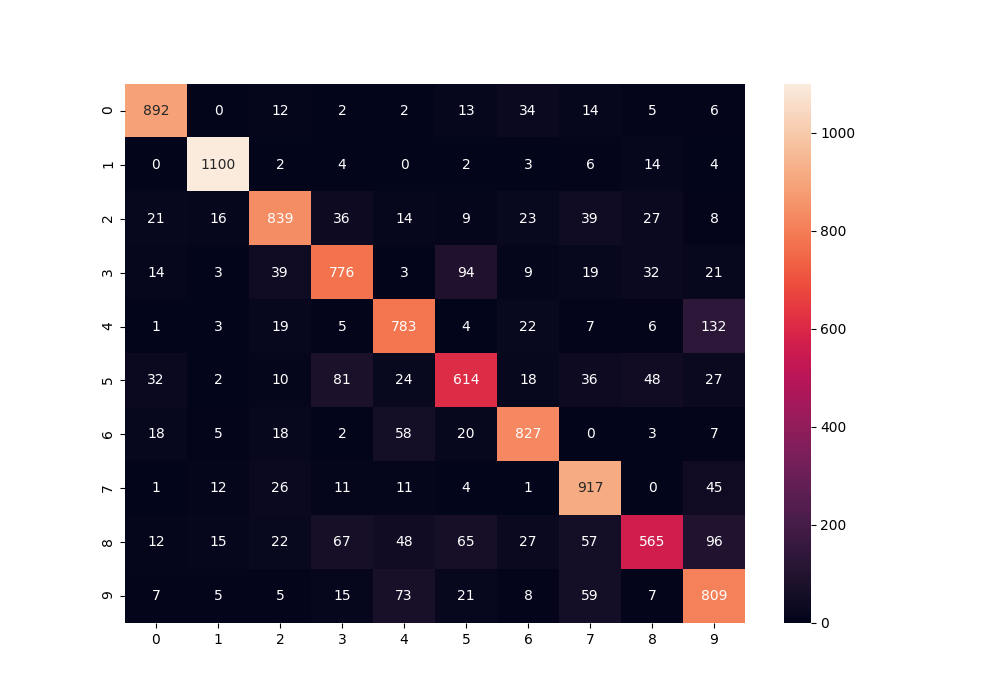
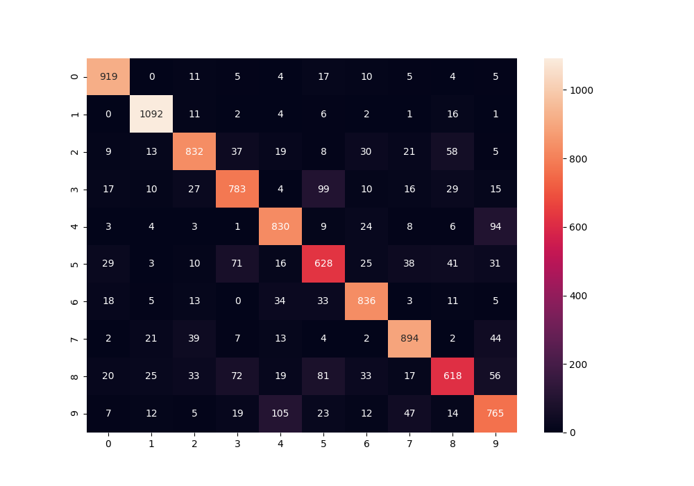
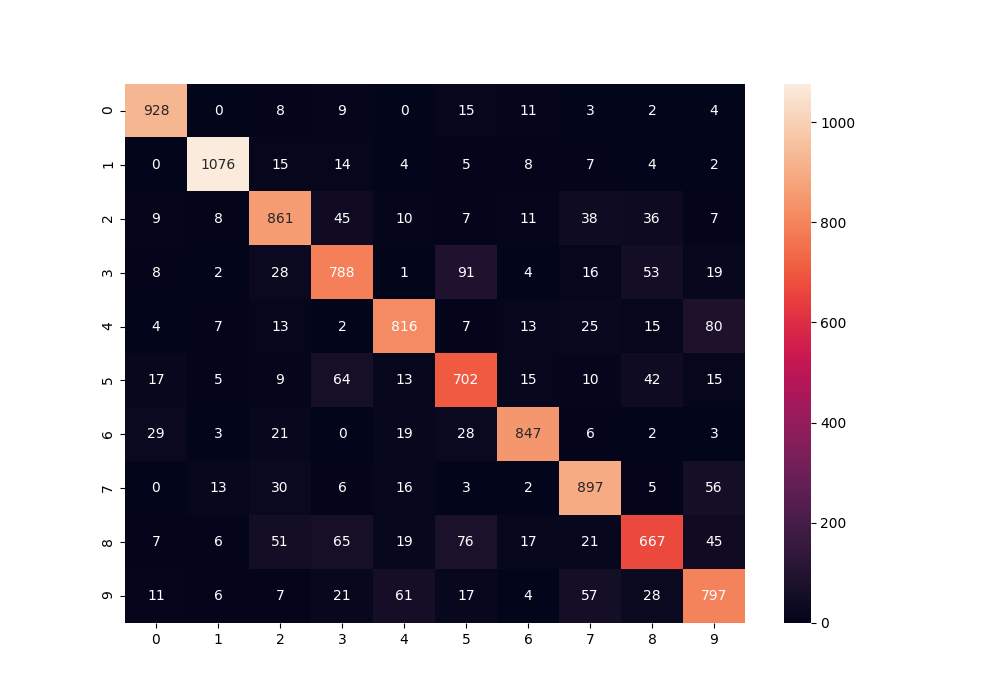
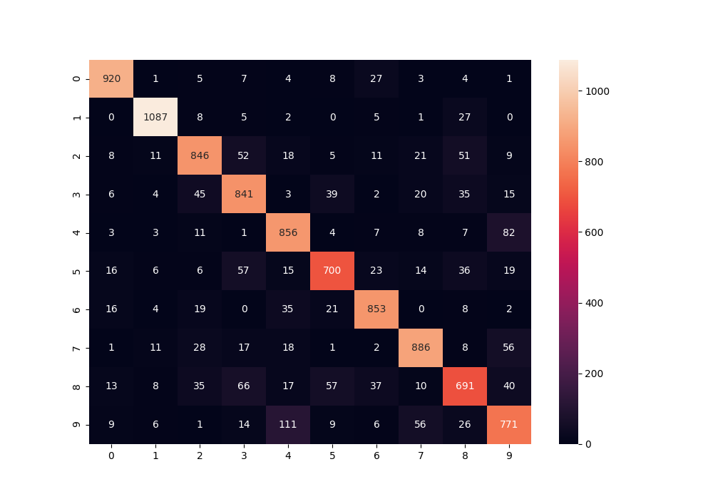

# CSCI596-FedLearningProject

**Group Member:**

Mingyue Tang (6295173646): Read Literatures and looking for baseline code, implemented part of the algorithm (federated Learning training, and testing) , wrote part of the research report, weekly meeting with all group members

Xinrui Li: Read Literatures and looking for baseline code, implemented part of the algorithm (federated Learning training: algorithm 1 and algorithm 2) , wrote part of the research report, weekly meeting with all group members

## Goal: Try to solve data imbalance problem in Federated Learning

### Background:
**Federated Learning**:

Federated learning (also known as collaborative learning) is a machine learning technique that trains an algorithm across multiple decentralized edge devices or servers holding local data samples, without exchanging them. This approach stands in contrast to traditional centralized machine learning techniques where all the local datasets are uploaded to one server, as well as to more classical decentralized approaches which often assume that local data samples are identically distributed.

**Data imbalance**:

1) Size Imbalance, where the data size on each device (or client) is uneven; 
2) Local Imbalance, i.e., independent and non-identically distribution (non-IID), where each device does not follow a common data distribution; 
3) Global Imbalance, means that the collection of data in all devices is class imbalanced

**Proposed solution**:

Paper Link: https://ieeexplore.ieee.org/document/9141436

Model Framework:

Algorithm Framework:

Workflow:
1) Initialization: The FL server initializes the weights and the optimizer of the neural network model and collects the local data distribution of participants;
2) Rebalancing: First, we perform the z-score-based data augmentation and downsampling to relieve the global imbalanced of training data. Then, we propose the mediator which asynchronouly receives and applies the updates from clients to averaging the local imbalance;
3) Training: First, each mediator sends the model to the subordinate clients. Then each client trains the model for E local epochs and returns the updated model to the corresponding mediator. Loops this process Em times. Finally, all the mediators send the updates of models to the FL server;
4) Aggregation: The FL server aggregates all the updates using the FedAvg algorithm

**Benchmark and Dataset**:

https://github.com/chaoyanghe/Awesome-Federated-Learning#Benchmark-and-Dataset

**Baseline Code (just examples)**:
- https://github.com/shaoxiongji/federated-learning

- https://github.com/ivishalanand/Federated-Learning-on-Hospital-Data

- https://github.com/AshwinRJ/Federated-Learning-PyTorch

### Steps:
- Replicate Baseline Code
- Run evaluation pipeline
- Improve the baseline by https://docs.google.com/document/d/1qa0Cv-axRw9ZSVDB-C5YZMp9lEd6qp3d1FmzX7D8Mgg/edit methods
- Propose our own method (optional)

### Experiment:

#### Experiment Setup:

We ran three groups of experiments with three different imbalanced conditions, size-imbalance, local-imbalance, and global-imbalance. Each group contained two experiments, one is for the baseline model and another one is for our proposed self-balanced model. 

**Global Parameters:**

All the default parameters are in utils/options.py, for the seek of fairness we have the same set of global parameters for all the running experiments

**Imbalanced Dataset Parameters setup:**

To ensure each group of experiment is running on a same distributed imbalance dataset, we wrote our own dataset generation method in DataBalance.py and DataProcessor.py. Different imbalance type has different set of parameters need to be set.

Size Imbalance:

- list_size: list_size is a size indicates the size of each device

Local Imbalance:

- num_device: num_device indicates the number of the devices
- device_size: device_size is the size of each device (it's an integer, not a list, as each device should have the same size)
- alpha: Alpha = 0 means full random sampling, totally balanced, Alpha = 1 means no sampling, each device takes only one class, totally imbalanced

Glabal Imbalance:

- num_device: num_device indicates the number of the devices
- device_size: device_size is the size of each device (it's an integer, not a list, as each device should have the same size)
- num_each_class: num_each_class is a list indicating the number for each class

### Result:

**Running Parameter:** --size_balance(local_balance/gloabal_balance) --confusion_matrix --epochs 10 --gpu -1

**Test Set Comparsion Result**

|  Imbalance Type  | Baseline Model Test Set Accuracy | Self-balanced Model Test Set Accuracy |
| :--------------: |  :-------------:  |  :-------------: |
| Size Imbalance   | 81.22% |87.05%|
| Local Imbalance  | 88.42% |89.46%|
| global Imbalance |      68.06%      |      70.95%      |

The self-balance model outperformed the baseline model in all three conditions with a 10 epochs training. There are 5.83% improvement on the size imbalance situation, 1.04% on local imbalance, 2.89% on global imblance with the same experiment setup.

#### Detailed breakdown:

##### Size-Balance

<b>Figure. Baseline Model Test Confusion Matrix on Size Imbalance</b>

<b>Figure. Self-balance Model Test Confusion Matrix on Size Imbalance</b>

From the confusion matrix, it's clear to see the **self-balance model** have better classification result on almost every classes(9/10). Better in both precision and recall. So overall, it has a better F1 score than the **baseline model**

**Local Balance:**

<b>Figure. Baseline Model Test Confusion Matrix on Local Imbalance</b>

<b>Figure. Self-Balance Model Test Confusion Matrix on Local Imbalance</b>

From the confusion matrix, the **self-balance model** do not have significant improvement accourding to the classes (6/10 are outperformed). It narrowly beats the baseline function on both accuarcy and f1 scores. 

